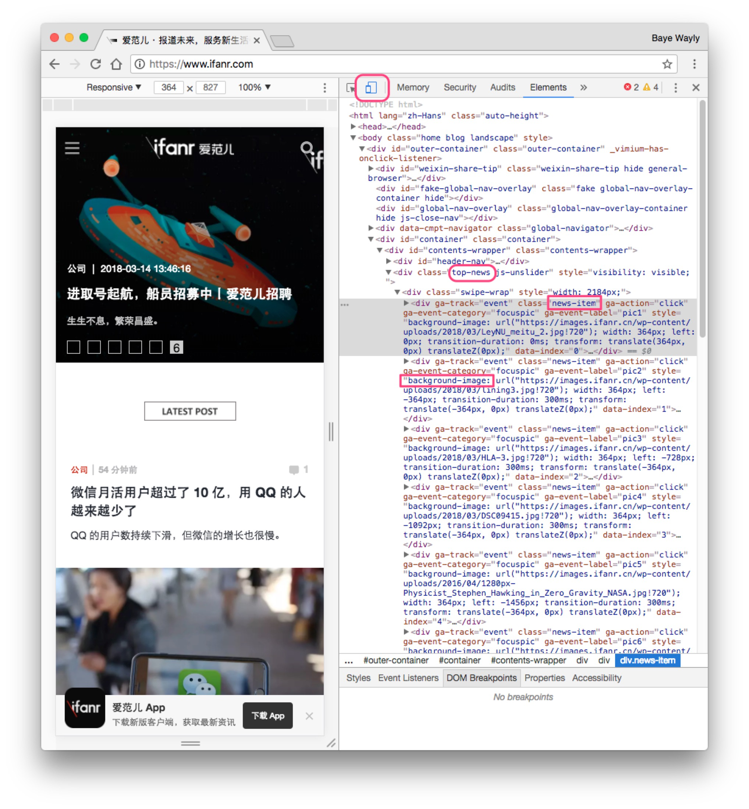

# 无相编辑器手把手教程

这篇文章将手把手教你做一个 ifanr 原生 App 出来

## 1. 注册一个账号

你可以在 TestFlight 更新中找到地址。

## 2. 新建一个应用（相）

1. 应用名字输入 "ifanr" 然后点击右上角的 "保存"，保存后下面会显示一个二维码。
2. 打开「无相」点击搜索框右边的“三点”按钮，在弹出菜单中选择 `Scan Qr`
3. 扫描二维码后「无相」会自动进入调试模式，并显示 `Waiting for Push` 表示正在准备接收指令。

这时候你点击二维码下面的 `推送更新` 后「无相」会显示  `No Initial URL` 表示此应用没有设置一个初始地址，在 `起始地址` 中填入 `https://www.ifanr.com` 再点击推送就会显示 `No Matched Page found`。然后我们就要进入下一步开始适配将主页变成 App 吧！

## 3. 相的配置

1. 新建一个页面，匹配URL 填入 `/` 表示这个页面将会匹配主页。
2. 在右侧拖入一个 `Carousel` 控件，这是一个幻灯片组件。
3. 在 `selector` 中填入 `.top-news .news-item`，`title` 中填入 `h1`，`image` 中填入 `@background-image`，`url` 中填入 `.news-link @href`

再点击 `推送更新` 现在手机是不是自动刷新并且显示了一个幻灯片啦？

### 填的那些是什么意思？

「无相」的每个控件都会从 HTML 中提取信息，填入的那些就是 `CSS 选择器`，「无相」会提取出匹配的 `HTML 元素的值` 然后更新控件。

### 3.1 打开开发者工具

1. 用电脑 Chrome 打开 [https://www.ifanr.com](https://www.ifanr.com) 
2. 使用右键选择 `审查元素` 来打开开发者工具
3. 点击左上角的第二个图标，切换到移动浏览器模式（更改 User Agent）然后刷新就会进入手机版

### 3.2 查看元素信息

然后右键顶部的幻灯片，选择 `审查元素` 如果你懂 CSS 的话你就会看到，幻灯片的容器有个 `class` 叫做 `.top-news`，然后每个幻灯片有个 `class` 叫做 `.news-item`

我们上面填的 `selector` 就是选择每一个 `.top-news .news-item` 元素。

* `image` 的 `@background-image` 指的是选择这个元素的 `style 里面的 background-image 图片`，用这个图片作为幻灯片的图片。
* `title` 填的 `h1` 就是选择这个元素下面的 `h1` 子元素，用这个子元素的文本作为幻灯片标题。
* `url` 填的 `.news-link @href` 表示选择 `.news-link` 这个子元素，并且使用 `@href` 属性的值作为链接地址。

